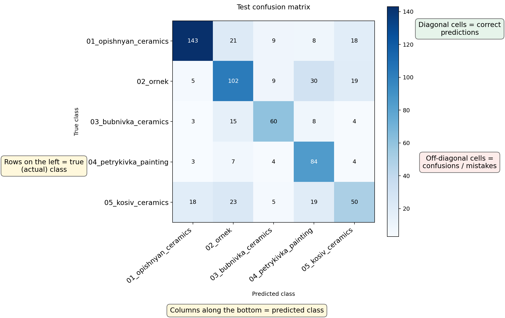

<sub>*Confusion matrix from the current Step 1 classifier run on the provided `dataset_test` split.*</sub>

# AISTER Ukrainian visual intangible cultural heritage classifier

This repository contains a reproducible prototype for identifying the type of visual intangible cultural heritage represented in an image from Ukraine.

The current workflow uses **direct supervised classification**, because the available dataset is already labeled by heritage category:

1. `01_opishnyan_ceramics`
2. `02_ornek`
3. `03_bubnivka_ceramics`
4. `04_petrykivka_painting`
5. `05_kosiv_ceramics`

## Prototype description

The current prototype is designed as a lightweight but explainable vision baseline.

It combines three complementary visual descriptors:

- HSV color histograms for palette and glaze cues
- HOG descriptors for composition, contours, and motif layout
- uniform LBP texture histograms for surface pattern information

The workflow benchmarks a small set of candidate classifiers on a validation split from `dataset_dev/`, selects the best performer, retrains it on the full development split, and evaluates it on `dataset_test/`.

## Repository description

The repository currently contains one documented workflow stage:

- `step_1/` contains the end-to-end heritage type classification notebook, dataset, and cached outputs

For teaching and hands-on exercises, use `step_1/workshop_materials/`. It contains a simplified participant notebook and a local data template for trying the same classical classification workflow on participant-chosen public-image categories.

## Why this technology

This project uses a supervised classifier instead of DINOv2 retrieval because the task is category recognition, not open-ended nearest-neighbour search.

The best-performing current setup is:

- feature set: `all` = color histogram + HOG + LBP
- classifier: `knn_cosine_k5`
- input resolution: `96x96`

This choice came from a validation benchmark rather than a manual preference.

## Current metrics snapshot

The cached metrics in `step_1/outputs/metrics.json` report the following values for the current dataset snapshot:

| Metric              |           Value |
| ------------------- | --------------: |
| Selected model      | `knn_cosine_k5` |
| Validation accuracy |          72.92% |
| Test accuracy       |          65.42% |
| Test top-3 accuracy |          89.57% |
| Training images     |           1,384 |
| Test images         |             671 |

Per-class test recall:

- `01_opishnyan_ceramics`: 71.86%
- `02_ornek`: 61.82%
- `03_bubnivka_ceramics`: 66.67%
- `04_petrykivka_painting`: 82.35%
- `05_kosiv_ceramics`: 43.48%

## Current output files

- `step_1/outputs/model_selection.csv`
- `step_1/outputs/test_predictions.csv`
- `step_1/outputs/metrics.json`
- `step_1/outputs/confusion_matrix.csv`
- `step_1/outputs/confusion_matrix.png`
- `step_1/outputs/dataset_summary.csv`

## Reproducibility notes

- The dataset lives under `step_1/data/`.
- The current workflow expects:
  - `step_1/data/dataset_dev/<class_name>/*.jpg`
  - `step_1/data/dataset_test/<class_name>/*.jpg`
- Accepted extensions are `.jpg`, `.jpeg`, `.png`, `.bmp`, `.webp`, `.tif`, and `.tiff`.

## How to run

Open and run [step_1-01_visual_heritage_classifier.ipynb](/Users/memerchik/Documents/GitHub/aister_intangible_visual/step_1/notebooks/step_1-01_visual_heritage_classifier.ipynb) from top to bottom.

The notebook includes a dependency-install cell with:

```python
%pip install numpy pandas Pillow matplotlib scikit-image scikit-learn
```

Run that cell once if needed, then continue with the rest of the notebook. The final export cell refreshes the files in `step_1/outputs/`.

For the hands-on workshop version, open `step_1/workshop_materials/notebooks/classical_vision_hands_on.ipynb`.

## Limitations

- This is a compact classical-vision prototype, not a fine-tuned deep network.
- The classifier is strongest as a category recognizer and does not yet support unknown-class rejection.
- `05_kosiv_ceramics` remains the hardest class in the current setup and is the clearest candidate for future improvement.
